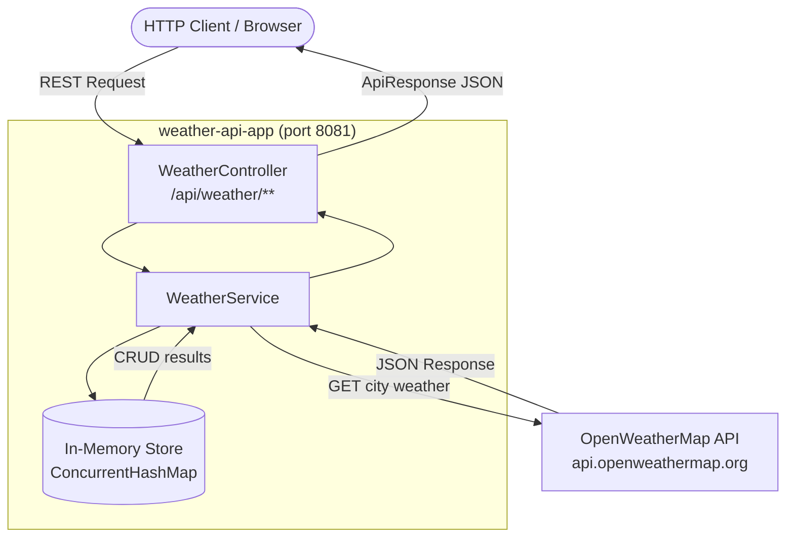
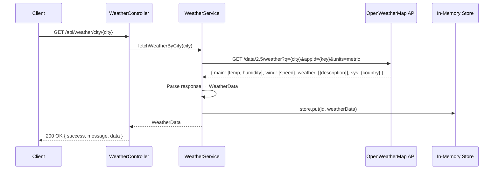
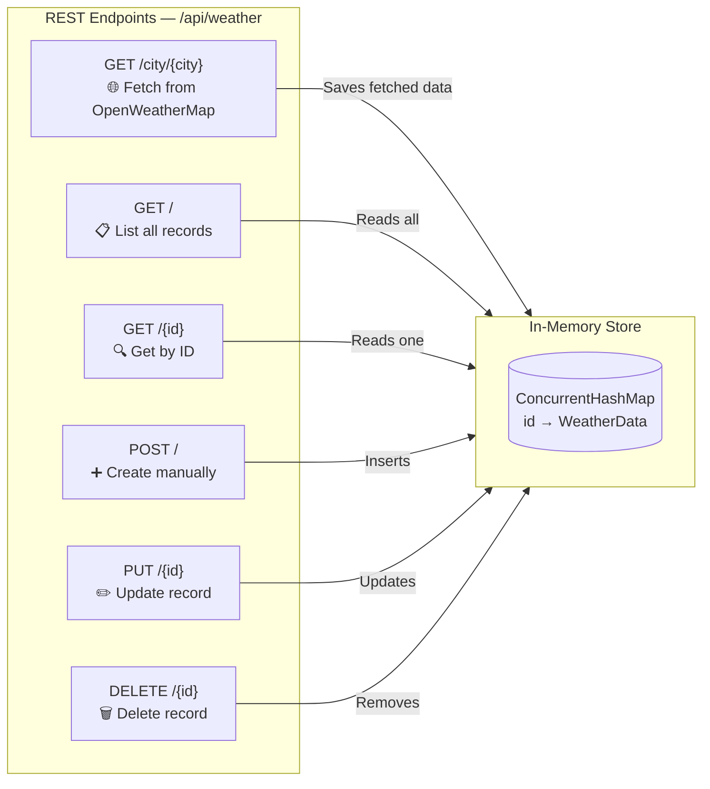

# Weather API Application

A Gradle-based Spring Boot application that integrates with the **OpenWeatherMap API** to fetch live weather data and provides a full set of CRUD REST endpoints backed by an in-memory store.

- **Base URL:** `http://localhost:8081`
- **External API:** [OpenWeatherMap](https://openweathermap.org/api)
- **Port:** `8081`

---

## Architecture Overview



---

## Data Flow — Fetch by City



---

## Getting Started

### Prerequisites
- Java 11+
- Gradle 7.6+ (or use the included `gradlew` wrapper)
- Free API key from [openweathermap.org](https://openweathermap.org/appid)

### Configuration

Open `src/main/resources/application.properties` and replace the API key:

```properties
server.port=8081
weather.api.base-url=https://api.openweathermap.org/data/2.5
weather.api.key=YOUR_API_KEY_HERE
```

> **Note:** With `api.key=demo`, external API calls will fail (401). Local CRUD operations (POST, PUT, DELETE, GET all/by-id) work without a key.

### Run the Application

```bash
# First-time setup: generate Gradle wrapper
gradle wrapper --gradle-version 7.6.1

# Build
./gradlew clean build -x test

# Run
./gradlew bootRun
```

The app starts at `http://localhost:8081`.

---

## WeatherData Model

| Field         | Type            | Description                          |
|---------------|-----------------|--------------------------------------|
| `id`          | Long            | Auto-assigned local ID               |
| `city`        | String          | City name                            |
| `country`     | String          | Country code (e.g. `US`, `IN`)       |
| `temperature` | Double          | Temperature in °C                    |
| `humidity`    | Integer         | Humidity percentage                  |
| `description` | String          | Weather description (e.g. `clear sky`) |
| `windSpeed`   | Double          | Wind speed in m/s                    |
| `timestamp`   | LocalDateTime   | Record creation timestamp            |

---

## API Reference

### Response Envelope

All endpoints return the same wrapper:

```json
{
  "success": true,
  "message": "Descriptive message",
  "data": { ... }
}
```

---

### 1. GET — Fetch Weather from External API

Fetches live data from OpenWeatherMap and saves it to the local store.

```
GET /api/weather/city/{city}
```

**Path Parameter:** `city` — name of the city (e.g. `London`, `Mumbai`)

**Example:**
```bash
curl -X GET "http://localhost:8081/api/weather/city/London"
```

**Success Response (200 OK):**
```json
{
  "success": true,
  "message": "Weather data fetched successfully",
  "data": {
    "id": 1,
    "city": "London",
    "country": "GB",
    "temperature": 14.5,
    "humidity": 72,
    "description": "overcast clouds",
    "windSpeed": 5.2,
    "timestamp": "2026-03-24T10:30:00"
  }
}
```

**Error Response (500):**
```json
{
  "success": false,
  "message": "Error: 401 Unauthorized - Invalid API key",
  "data": null
}
```

---

### 2. GET — List All Stored Weather Records

Returns all weather records currently held in the in-memory store.

```
GET /api/weather
```

**Example:**
```bash
curl -X GET "http://localhost:8081/api/weather"
```

**Success Response (200 OK):**
```json
{
  "success": true,
  "message": "Weather data retrieved successfully",
  "data": [
    {
      "id": 1,
      "city": "London",
      "country": "GB",
      "temperature": 14.5,
      "humidity": 72,
      "description": "overcast clouds",
      "windSpeed": 5.2,
      "timestamp": "2026-03-24T10:30:00"
    },
    {
      "id": 2,
      "city": "Mumbai",
      "country": "IN",
      "temperature": 32.0,
      "humidity": 88,
      "description": "haze",
      "windSpeed": 3.1,
      "timestamp": "2026-03-24T10:35:00"
    }
  ]
}
```

---

### 3. GET — Get Weather Record by ID

Retrieves a single stored weather record by its local ID.

```
GET /api/weather/{id}
```

**Path Parameter:** `id` — local record ID (Long)

**Example:**
```bash
curl -X GET "http://localhost:8081/api/weather/1"
```

**Success Response (200 OK):**
```json
{
  "success": true,
  "message": "Weather data retrieved successfully",
  "data": {
    "id": 1,
    "city": "London",
    "country": "GB",
    "temperature": 14.5,
    "humidity": 72,
    "description": "overcast clouds",
    "windSpeed": 5.2,
    "timestamp": "2026-03-24T10:30:00"
  }
}
```

**Not Found Response (404):**
```json
{
  "success": false,
  "message": "Weather data not found for ID: 99",
  "data": null
}
```

---

### 4. POST — Create Weather Record Manually

Manually add a weather data entry to the local store without calling the external API.

```
POST /api/weather
Content-Type: application/json
```

**Request Body:**
```json
{
  "city": "New York",
  "country": "US",
  "temperature": 18.5,
  "humidity": 60,
  "description": "partly cloudy",
  "windSpeed": 4.7
}
```

**Example:**
```bash
curl -X POST "http://localhost:8081/api/weather" \
  -H "Content-Type: application/json" \
  -d '{
    "city": "New York",
    "country": "US",
    "temperature": 18.5,
    "humidity": 60,
    "description": "partly cloudy",
    "windSpeed": 4.7
  }'
```

**Success Response (201 Created):**
```json
{
  "success": true,
  "message": "Weather data created successfully",
  "data": {
    "id": 3,
    "city": "New York",
    "country": "US",
    "temperature": 18.5,
    "humidity": 60,
    "description": "partly cloudy",
    "windSpeed": 4.7,
    "timestamp": "2026-03-24T11:00:00"
  }
}
```

---

### 5. PUT — Update an Existing Weather Record

Update a stored weather record by ID. The `id` in the path takes precedence.

```
PUT /api/weather/{id}
Content-Type: application/json
```

**Path Parameter:** `id` — local record ID (Long)

**Request Body:**
```json
{
  "city": "New York",
  "country": "US",
  "temperature": 21.0,
  "humidity": 55,
  "description": "sunny",
  "windSpeed": 3.2
}
```

**Example:**
```bash
curl -X PUT "http://localhost:8081/api/weather/3" \
  -H "Content-Type: application/json" \
  -d '{
    "city": "New York",
    "country": "US",
    "temperature": 21.0,
    "humidity": 55,
    "description": "sunny",
    "windSpeed": 3.2
  }'
```

**Success Response (200 OK):**
```json
{
  "success": true,
  "message": "Weather data updated successfully",
  "data": {
    "id": 3,
    "city": "New York",
    "country": "US",
    "temperature": 21.0,
    "humidity": 55,
    "description": "sunny",
    "windSpeed": 3.2,
    "timestamp": "2026-03-24T11:15:00"
  }
}
```

**Not Found Response (404):**
```json
{
  "success": false,
  "message": "Weather data not found for ID: 99",
  "data": null
}
```

---

### 6. DELETE — Remove a Weather Record

Delete a stored weather record by ID.

```
DELETE /api/weather/{id}
```

**Path Parameter:** `id` — local record ID (Long)

**Example:**
```bash
curl -X DELETE "http://localhost:8081/api/weather/3"
```

**Success Response (200 OK):**
```json
{
  "success": true,
  "message": "Weather data deleted successfully",
  "data": null
}
```

**Not Found Response (404):**
```json
{
  "success": false,
  "message": "Weather data not found for ID: 99",
  "data": null
}
```

---

## CRUD Operations Summary



---

## HTTP Status Codes

| Status | Meaning                          | When                              |
|--------|----------------------------------|-----------------------------------|
| `200`  | OK                               | Successful GET, PUT, DELETE       |
| `201`  | Created                          | Successful POST                   |
| `404`  | Not Found                        | ID doesn't exist in store         |
| `500`  | Internal Server Error            | External API failure or exception |

---

## Project Structure

```
weather-api-app/
├── build.gradle
├── settings.gradle
├── gradlew / gradlew.bat
├── setup.sh
└── src/
    └── main/
        ├── java/com/weather/
        │   ├── WeatherApiApplication.java    ← Spring Boot entry point
        │   ├── config/
        │   │   └── AppConfig.java            ← WebClient bean
        │   ├── controller/
        │   │   └── WeatherController.java    ← REST endpoints
        │   ├── model/
        │   │   ├── WeatherData.java          ← Data model
        │   │   └── ApiResponse.java          ← Response wrapper
        │   └── service/
        │       └── WeatherService.java       ← Business logic + external API call
        └── resources/
            └── application.properties
```
